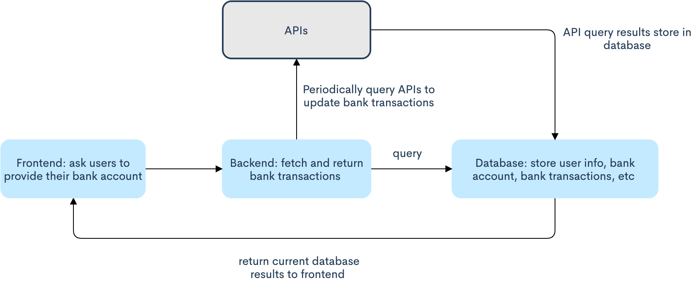
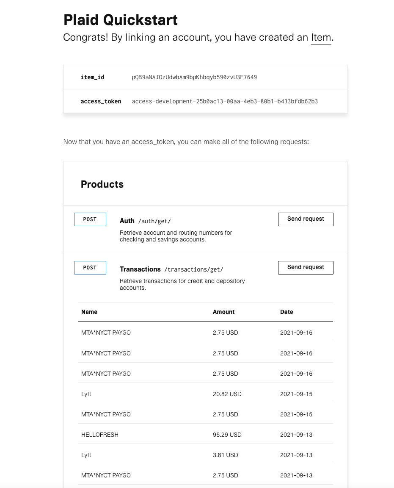

# Budget Web App 
Author: Jennifer Zeng

Contributors: Alan Chen, Andy Huang, Daanyal Akhtar, Michelle Tang, Sebastian Lopez, Tomer Yaakov

[Design Doc](https://docs.google.com/document/d/1yhA75AGxCYOdqQVFb3dU0rH4Cb3hcuQu0ZmYiSqXpFA/edit#heading=h.wmr0r83w17jn)

## Motivation 
Online transactions have become increasingly popular with the advent of ecommerce and online banking. Subsequently, budget management naturally shifts from paper and books to online applications. Good budgeting can help elevate understanding of income and spending, resulting in higher control over finance.

Typically, budgeting apps work by connecting a user to a bank account and credit cards to automatically download transactions and categorize their spending to match the budget they choose. However, one limitation of most current budget apps is that they don’t offer customers the option to customize categories. This is the problem we will address in this product. 
Besides providing category suggestions, customers can customize and detail categories according to their preferences. This will allow for both the presence of "intelligent" suggestions per say, as well as user-defined categories in the event that more accuracy is required/desired.


## Customer Pain Point 
As mentioned in Motivation, one customer pain point is that most budget apps don’t offer 
the option to customize categories. The lack of customization results in lower accuracy in 
categorizing transactions. For example, on most budget apps, transactions at CVS are often 
categorized as health, fitness, or medicine. While CVS as a merchant is categorized as a pharmacy, merchandise from CVS scopes much further than simply its default-categorization, such as food, drinks, and other household items. This of course could be applied to other chain stores which may be categorized by default. Thus, the principle problem of lack of customization for both individual necessity and overall accuracy is the problem we want to solve.


## Audience 
We target those who want to have a detailed view of their spending, gain insights into their spending habits, and cultivate 
a budgeting mindset. Therefore, a principle target-audience is young people fresh out of high school/college. During this time, 
students transition from spending parents' money to making money independently. While they may have spent purely based on their likings in the past, that spending was likely not influenced by thoughts of cost-effectiveness or true necessity. Our app exists to cultivate such awareness of money and budgeting. We aim to do this specifically by providing them with customizable categories. By doing this, we enable our audience to see detailed breakdowns of their spending, 
which then helps them learn more about their spending habits and invoke their reflections about money and financial responsibility. 

## Implementation 

### Architecture 
<p align="center">  
     
</p>

According to the course requirements, we need to have frontend (javascript), backend (nodejs, expressjs), 
and database (mongoDB) components. The overall architecture is illustrated above. 

The frontend serves as an entry point for users to select their bank and enter bank account info 
(here we can use the interface that Plaid provides). This information is passed to the backend, 
which then queries the database directly and returns results. The backend may also concurrentlyrun a background scheduler to periodically query APIs to update the database. The goal of adding the background scheduler is to hide API latency from users, since queries can take time to transfer data to the front end.

However, one concern is that it can be difficult to pre-populate users’ bank information ahead of time as there is a waiting period between users' entry of bank information and the actual API fetch (i.e. input of bank information is required for API call). Ultimately, by having a database as a cache, a user can repeatedly query the backend rapidly and obtain feedback in a relatively short time without the need for an API query.


### Fetching Bank Transactions 

#### Method 1: Plaid API 
Language: Python, NodeJS 

We are going to use the API gateways provided by Plaid. By following [this tutorial](https://dashboard.plaid.com/overview/sandbox), 
I was able to get bank transactions: 
<p align="center">  
     
</p>

More thoughts on Plaid: 
Plais is essentially a middle layer - one where all connections to a bank to have been established and it can fetch relevant information including transactions, savings, etc. Plaid APIs provide a gateway to utilize its interface (i.e. the starting point where users are prompted to select a bank). One benefit of this API is that the only requirements are the bank name and the bank account information - the fetching of results is handled by Plaid.


#### Method 2: Mint API 
Language: Python, NodeJS

[Mintapi](https://github.com/dhleong/pepper-mint) provides APIs for directly getting both bank transactions and categories. 
While this API may be an easier path, utilization requires that the user is already Mint user, as it uses a Mint account to log in.


### Categorize Transactions 
Customers can fully customize their own categories. After retrieving the relevant data, the front end will be reponsible for adequately setting up and maintaining user-defined customizations.
The following shall be present: 
* A modal for creating categories; 
* Mechanisms that allow customers to categorize transactions, for example, 
draggable React components of transactions that can be directly dragged into a newly-created category. 


## Appendix 
### Steps for querying Plaid APIs 
1. Go to [this tutorial](https://dashboard.plaid.com/overview/sandbox) and follow instructions. This tutorial is for testing in Sandbox environment.  
Note that, you’ll be able to run the frontend page up, but if you enter your actual bank info, you will not get through. 
The reason is that Sandbox environment doesn’t use real-world data. Regarding different environment terminology, see [here](https://plaid.com/docs/quickstart/glossary/#environments).
2. To use actual bank account, modify your env to ```'development'``` in .env file of your directory 
3. You may encounter an SSL certificate error. To solve this error, follow [this post](https://stackoverflow.com/questions/50236117/scraping-ssl-certificate-verify-failed-error-for-http-en-wikipedia-org). 

### Justification for scope
This project is stackable in nature. That is, it can be simplified or made more complex depending on the relevant progress.

Thus, it may be easily adaptable to dynamic circumstances. 

As a preliminary, the frontend will consist of two pages, input for users' bank information, and displaying transactions/customizing categories respectively. While this is basic functionality, a more complex vision could entail the addition of other navigation tabs which will guide the user to other functionalities such as investment, savings, etc. 

The backend may be as simple as querying the remote API, or more complex with a background scheduler as mentioned previously. While the presence of a background scheduler would most certainly boost performance, it is not essential to the application and can be saved as a bonus.

Ultimately, the scope of this project is suitable for a scrum team with 4-6 programmers as both the front end and the back end could take equally the same time and same amount of effort, depending on progress. The  front-end and back-end are sophisticated enough to warrant a high degree of self-learning and learning curve, but not so demanding such that it is not within the realm of possibility for a semester-long proejct.

